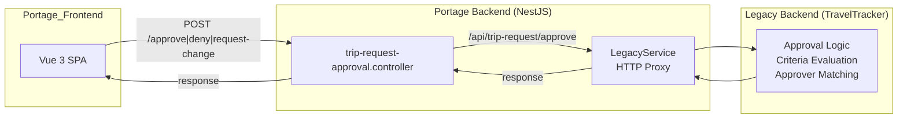

# Approval Workflow Deep Dive

## Approval Processing Flow {#wiki-approval-workflow-deep-dive-approval-processing-flow}

The approval system uses a **hybrid architecture** where Portage backend acts as an API gateway, delegating actual approval logic to the legacy TravelTracker backend via `LegacyService`.



**Approval flow:**

```
1. Trip is submitted → submitTripRequest()
   ├── Sets status = SUBMITTED, resets trip_approvals to approved=0
   ├── Calls legacyService.refreshTripApprovalLevel() → proxies to legacy API
   └── Event: TRIP_REQUEST_SUBMIT → handleOnTripRequestSubmit()

2. Legacy backend processes:
   ├── Evaluates approval_level_criteria (JS expressions)
   ├── Matches approvers by approvalLevelId + locationId + tripTypeId
   ├── Handles funding source approvals (creates entries per funding source)
   └── Saves to trip_approvals table

3. Approval actions (Portage BE → LegacyService proxy):
   ├── POST /trip-request-approval/approve
   │   └── Proxies to /api/trip-request/approve with { approved: 1 }
   ├── POST /trip-request-approval/deny
   │   └── Proxies with { approved: 2 }
   ├── POST /trip-request-approval/request-change
   │   └── Proxies with { approved: 3 }
   ├── POST /trip-request-approval/bulk-approve
   │   └── Proxies to /api/trip-request/bulk-approve
   └── POST /trip-request-approval/reset-approval
       └── Proxies to /api/trip-request/reset-approval

4. Post-action handlers (Portage BE):
   ├── handleOnTripRequestSubmit() sets pendingApprovalLevel or approved=1
   ├── Creates recurring trips (createRecurringTrips)
   ├── Auto-assigns vehicles (LegacyService.isTripRequestReadyToAssign)
   └── Sends notifications via TripRequestNotificationService
```

**Approval state values** (`trip_approvals.approved`):

| Value | Status            | Description       |
| ----- | ----------------- | ----------------- |
| 0     | pending           | Awaiting approval |
| 1     | approved          | Approved          |
| 2     | denied            | Denied            |
| 3     | changes_requested | Request changes   |

**Approval action values** (sent to legacy API):

| Value | Action          | Effect                            |
| ----- | --------------- | --------------------------------- |
| 1     | APPROVE         | Approves the level                |
| 2     | DENY            | Denies the trip                   |
| 3     | REQUEST_CHANGES | Requests changes, resets to draft |

**Key LegacyService methods for approvals:**

```typescript
// In apps/api/src/legacy/legacy.service.ts
async updateApprovalOnTripRequest(data, options)   // Single approval
async bulkUpdateApprovalOnTripRequest(data, options) // Bulk approve
async resetApprovalOnTripRequest(options)           // Reset to level N
async refreshTripApprovalLevel({ tripRequestIds, recompute }, options)  // Refresh levels
```

---

## Configuring Approval Levels {#wiki-approval-workflow-deep-dive-configuring-approval-levels}

Each approval level has these properties:

| Property            | Purpose                                                        |
| ------------------- | -------------------------------------------------------------- |
| `name`              | Display name (e.g. "Principal", "Transportation Director")     |
| `seq`               | Ordering — lower `seq` = earlier in the chain                  |
| `approvalTripTypes` | Which trip types trigger this level (many-to-many)             |
| `approvalCriteria`  | Additional conditions that must be met for this level to apply |
| `assignBusses`      | Whether vehicle assignment can happen at this level            |
| `notify`            | Whether to notify the next approver when this level approves   |
| `incOvernightOOS`   | Overnight/out-of-state handling                                |
| `boardReport`       | Board report inclusion                                         |

**Approver assignment** is done via `UserFormApprovalLevels.vue` where an admin assigns a user as an approver for specific:

- Approval Level
- Location(s) (or "All Locations" = `0`)
- Trip Type(s)
- Primary flag (one primary per level+location+tripType combo)

---

## Data Models {#wiki-approval-workflow-deep-dive-data-models}

**`approval_level`** — Defines an approval stage:

```prisma
model approval_level {
  id                Int                        @id @default(autoincrement())
  name              String                     @VarChar(255)
  incOvernightOOS   Int                        @default(0) @TinyInt
  assignBusses      Int                        @default(0) @TinyInt
  boardReport       Int                        @default(0) @TinyInt
  notify            Int                        @default(0) @TinyInt
  seq               Int?
  created           Int
  approvalTripTypes approval_level_trip_type[]
  approvalCriteria  approval_level_criteria[]
}
```

**`approval_level_criteria`** — Conditional rules for when a level applies:

```prisma
model approval_level_criteria {
  id              Int            @id @default(autoincrement())
  approvalLevelId Int
  func            String?        @VarChar(1024)   // JS expression string
  label           String?        @VarChar(1024)
  approvalLevel   approval_level @relation(fields: [approvalLevelId], references: [id])
}
```

**`approval_level_trip_type`** — Which trip types trigger this level:

```prisma
model approval_level_trip_type {
  id              Int            @id @default(autoincrement())
  approvalLevelId Int
  tripTypeId      Int
  approvalLevel   approval_level @relation(fields: [approvalLevelId], references: [id])
  @@unique([approvalLevelId, tripTypeId])
}
```

**`approver`** — User assigned to approve at a specific level:

```prisma
model approver {
  id              Int     @id @default(autoincrement())
  uuid            String  @VarChar(36)
  userId          Int
  userEmail       String  @VarChar(255)
  approvalLevelId Int
  locationId      Int
  tripTypeId      Int
  isPrimary       Int     @default(0) @TinyInt
  user            tt_user @relation(fields: [userId], references: [id])
  @@unique([userId, userEmail, approvalLevelId, locationId, tripTypeId])
}
```

**Implementation note:** `approver.id` is an internal surrogate key and is **not** the primary join target for approval flow queries. In practice, approval matching uses `approvalLevelId + locationId + tripTypeId` and `userId` (joined to `tt_user.id`).

**`trip_approvals`** — Approval records per trip request:

```prisma
model trip_approvals {
  approvalLevelId Int
  tripRequestId   Int
  fundingSourceId Int          @default(0)
  approved        Int          @default(0)   // 0=pending, 1=approved, 2=denied, 3=changes_requested
  comments        String?      @VarChar(255)
  createdAt       DateTime?    @default(now())
  approvedAt      DateTime?
  approvedBy      Int?
  trip_request    trip_request @relation(...)
  tt_user         tt_user?     @relation(fields: [approvedBy], references: [id])

  @@id([approvalLevelId, tripRequestId, fundingSourceId])
}
```

**`level_approval`** — Audit trail for approval actions:

```prisma
model level_approval {
  id              Int    @id @default(autoincrement())
  tripRequestId   Int
  approvalLevelId Int
  approved        Int    @TinyInt   // 0=pending, 1=approved, 2=denied, 3=changes
  userId          Int
  timestamp       Int
  comments        String @Text
}
```

**`trip_request` relevant fields:**

```prisma
model trip_request {
  id                  Int
  status              Int?     // 0=draft, 1=submitted, 2=completed, -1=resubmit, -2=denied, -3=cancelled
  approved            Int?     @default(0)   // 0=not fully approved, 1=fully approved
  pendingApprovalLevel Int?    @default(0)   // ID of level awaiting approval, 0 if fully approved
  // ... other fields
}
```

---

## Determining Fully Approved {#wiki-approval-workflow-deep-dive-determining-fully-approved}

A trip is fully approved when:

1. **Every** `trip_approvals` record has `approved = 1` (or there are no approval levels)
2. `trip_request.approved = 1`
3. `trip_request.pendingApprovalLevel = 0`

```sql
-- Check: all levels approved
SELECT COUNT(*) as totalLevels,
       SUM(ta.approved = 1) as approvedLevels
FROM trip_approvals ta
WHERE ta.tripRequestId = ?

-- Trip is fully approved when: totalLevels = approvedLevels
-- Or when totalLevels = 0 (auto-approved, no matching approval levels)
```

**Auto-approval**: If no approval levels match a trip (no criteria met, no approvers configured), the trip is **auto-approved** with `pendingApprovalLevel = 0` and `approved = 1` set by `handleOnTripRequestSubmit()`.

---

## Frontend Approval Components {#wiki-approval-workflow-deep-dive-frontend-approval-components}

| File                                                  | Purpose                                                               |
| ----------------------------------------------------- | --------------------------------------------------------------------- |
| `modules/trip-request/component/TripActionBar.vue`    | Approve/Deny/Request Changes buttons; calls `tripApprovalStore`       |
| `modules/trip-request/review-tabs/ApprovalStatus.vue` | Displays approval level table with status, approver names, dates      |
| `modules/users/form/UserFormApprovalLevels.vue`       | Assign users as approvers for specific levels/locations/trip types    |
| `stores/settings/approvalLevel.ts`                    | Pinia store for fetching and filtering approval levels                |
| `stores/trips/tripApproval.ts`                        | Approval actions: approve, deny, request changes, bulk approve, reset |

**API endpoints for approval (Portage BE):**

| Method | Endpoint                                | Purpose                              |
| ------ | --------------------------------------- | ------------------------------------ |
| `POST` | `/trip-request-approval/approve`        | Approve a single level               |
| `POST` | `/trip-request-approval/deny`           | Deny the trip                        |
| `POST` | `/trip-request-approval/request-change` | Request changes                      |
| `POST` | `/trip-request-approval/bulk-approve`   | Bulk approve all matching trips      |
| `POST` | `/trip-request-approval/reset-approval` | Reset approval from a specific level |

---

## How Criteria Work {#wiki-approval-workflow-deep-dive-how-criteria-work}

Criteria are **JavaScript expression strings** stored in `approval_level_criteria.func` that are evaluated against a trip request:

```javascript
// Simple boolean field check
func = `tripRequest.outOfState`;

// Destination check
func = `prospectiveDestinationIds.includes(tripRequest.destinationId)`;

// Field comparison
func = `tripRequest.fieldName == 'value'`;
func = `tripRequest.fieldName > 10`;

// Custom form field
func = `tripRequest.customFormFields[Object.keys(tripRequest.customFormFields).find(e => e == 'fieldName')]`;
```

**Special criterion: "Funding Source"** — when a criteria label is "Funding Source", the system dynamically creates an approval level per funding source on the trip, using the funding source's designated approver.

---

## Key Architectural Notes {#wiki-approval-workflow-deep-dive-key-architectural-notes}

1. **Hybrid architecture**: Portage backend acts as an API gateway, delegating approval mutations to TravelTracker via `LegacyService` HTTP calls. The actual approval computation (criteria evaluation, approver matching) lives in TravelTracker.

2. **Approval state is stored in two places**:
   - `trip_approvals` table: Persistent approval records (managed by legacy, synced to Portage via Prisma)
   - `trip_request` fields: `approved` (0/1), `pendingApprovalLevel` (level ID)

3. **Sequential chain**: Levels ordered by `seq`. System finds first `approved = 0` as `awaitingApproval`. When approved, moves to next level.

4. **Primary vs Secondary approvers**: Primary approvers (`approver.isPrimary = 1`) can act on approvals. Secondary approvers are CC'd/visible in the UI.

5. **Funding source approvals**: When criteria has label "Funding Source", the system dynamically creates a separate approval level entry per funding source on the trip.

6. **Reset/Reinitiate**: Admin can reinitiate approval from level N — resets all levels from N onward to `approved = 0`, sets status back to `submitted`, notifies the first non-approved level's approver.

7. **Bulk approve**: Admin can approve all pending trips matching filter criteria in one operation via `POST /trip-request-approval/bulk-approve`.

---

## Known Edge Cases for Funding Source Approval {#wiki-approval-workflow-deep-dive-known-edge-cases-for-funding-source-approval}

Based on codebase analysis and database verification, there are scenarios where funding source approval may NOT be triggered:

---

