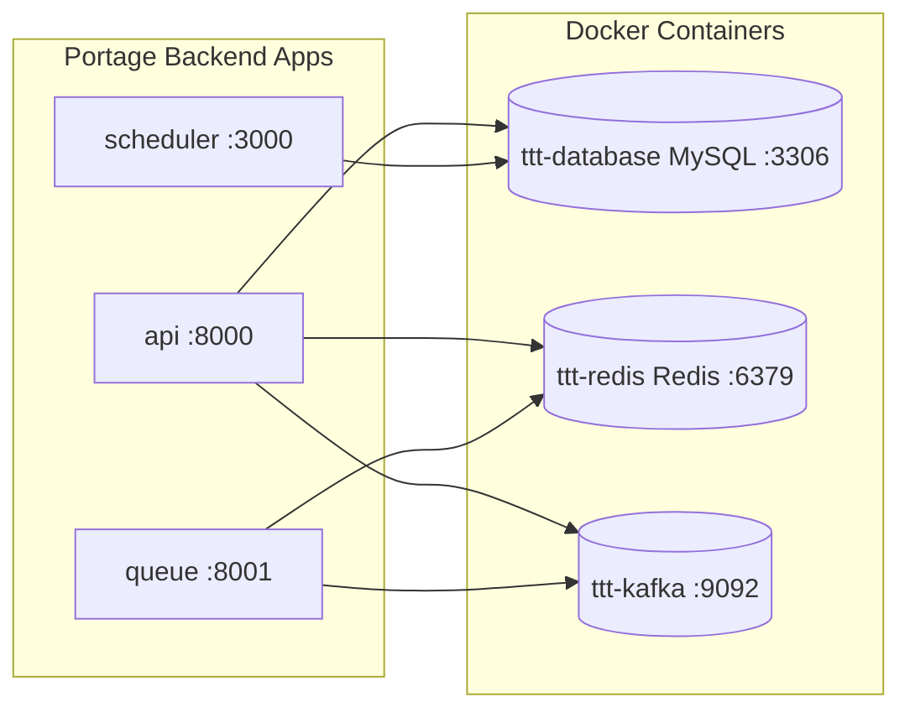

# Portage Backend — Docker Dependency Mapping

## Environment Variables → Docker Services {#wiki-docker-portage-backend-docker-dependency-mapping-environment-variables-docker-services}

> Values shown are from the actual `.env` files (secrets redacted). These are the values that map to Docker containers.

---

## Portage Apps and Their Docker Dependencies {#wiki-docker-portage-backend-docker-dependency-mapping-portage-apps-and-their-docker-dependencies}



| Portage App | Path | Docker Dependencies |
|---|---|---|
| **api** | `Portage-backend/apps/api/` | MySQL, Redis, Kafka |
| **queue** | `Portage-backend/apps/queue/` | Redis, Kafka |
| **scheduler** | `Portage-backend/apps/scheduler/` | MySQL |

---

## Skipping Kafka {#wiki-docker-portage-backend-docker-dependency-mapping-skipping-kafka}

If Kafka is not needed for a development session:

```env
SKIP_MICROSERVICES=true
```

This disables Kafka-dependent modules in the Portage backend.

---

---

