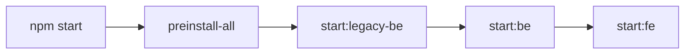

# Quick Reference: Full Local Dev Startup

## Alternative: Start Everything (All 3 Apps) {#wiki-docker-quick-reference-full-local-dev-startup-alternative-start-everything-all-3-apps}

```bash
# From repo root — installs all deps and starts Portage BE, Portage FE, and TravelTracker
npm start
```



This runs (sequentially):
1. `preinstall-all` — installs deps for all 3 projects (Portage BE, Portage FE, TravelTracker BE, TravelTracker UI)
2. `start:legacy-be` — TravelTracker (Express + Vue)
3. `start:be` — Portage backend (NestJS)
4. `start:fe` — Portage frontend (Nuxt)

---

