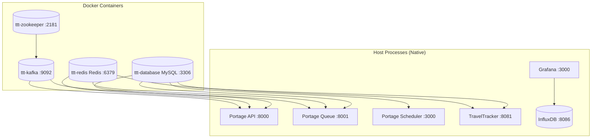
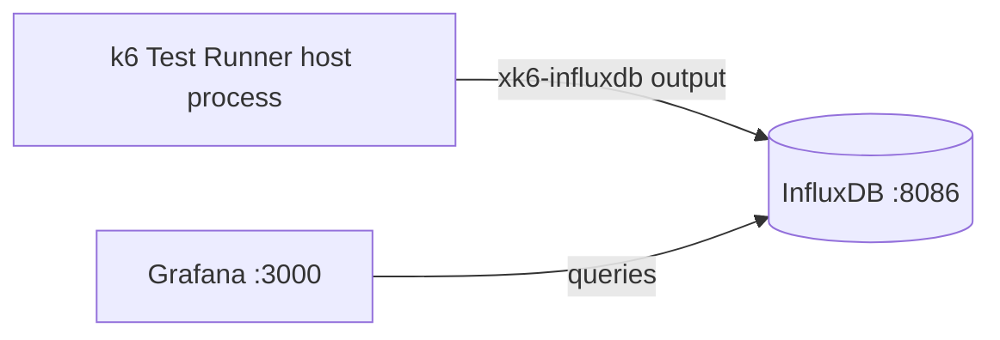
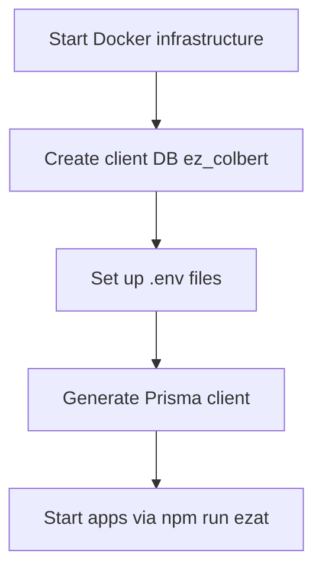
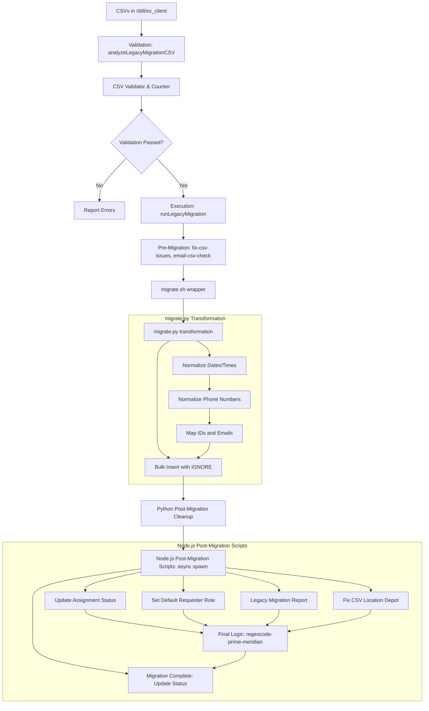

# Root

## Approval Workflow Deep Dive {#wiki-approval-workflow-deep-dive}

The approval system is multi-level, criteria-based, and sequential. A trip may need to pass through multiple approvers before it can be assigned.

---

## Code Examples {#wiki-code-examples}


---

## Common Developer Tasks {#wiki-common-developer-tasks}


---

## Development Workflow {#wiki-development-workflow}


---

## Architecture Summary {#wiki-docker-architecture-summary}



All application processes run **natively on the host** and connect to Docker containers via `127.0.0.1` (published ports).

---

---

## Load Testing Monitoring Stack {#wiki-docker-load-testing-monitoring-stack}

**Scripts:** `Portage-backend/test/load/start_grafana.sh`, `Portage-backend/test/load/stop_grafana.sh`

Uses Docker to run Grafana + InfluxDB for k6 load test visualization.



---

## Portage Backend — Docker Dependency Mapping {#wiki-docker-portage-backend-docker-dependency-mapping}

Portage Backend has **no Dockerfile or docker-compose**. It connects to TravelTracker's Docker containers via localhost ports.

---

## Port Map (All Docker Services) {#wiki-docker-port-map-all-docker-services}

| Host Port | Container Port | Service | Container Name | Used By |
|---|---|---|---|---|
| `3306` | `3306` | MySQL | `ttt-database` | Portage (all apps), TravelTracker |
| `6379` | `6379` | Redis | `ttt-redis` | Portage (api, queue), TravelTracker |
| `2181` | `2181` | Zookeeper | `ttt-zookeeper` | Kafka only |
| `9092` | `9092` | Kafka | `ttt-kafka` | Portage (api, queue) |
| `3000` | `3000` | Grafana | *(dynamic)* | Portage load testing |
| `8086` | `8086` | InfluxDB | *(dynamic)* | Portage load testing |

---

## Quick Reference: Full Local Dev Startup {#wiki-docker-quick-reference-full-local-dev-startup}



```bash
# 1. Start Docker infrastructure
cd TravelTracker/setup/docker && docker-compose up -d

# 2. Create client database if it doesn't exist
docker exec ttt-database mysql -u admin -psecret -e "CREATE DATABASE IF NOT EXISTS ez_colbert;"

# 3. Set up Portage backend env files (copy from example if missing)
cp -n Portage-backend/.env.example Portage-backend/.env
cp -n Portage-backend/apps/api/.env.example Portage-backend/apps/api/.env
cp -n Portage-backend/apps/queue/.env.example Portage-backend/apps/queue/.env
cp -n Portage-backend/apps/scheduler/.env.example Portage-backend/apps/scheduler/.env

# 4. Generate Prisma client
cd Portage-backend && npx prisma generate

# 5. Start Portage backend + frontend
cd /transAct && npm run ezat
```

---

## TravelTracker — Docker Dependency Mapping {#wiki-docker-traveltracker-docker-dependency-mapping}

TravelTracker connects to the same Docker containers via `config.json` (not `.env`).

---

## TravelTracker Infrastructure Stack {#wiki-docker-traveltracker-infrastructure-stack}

**Compose file:** `TravelTracker/setup/docker/docker-compose.yml`
**Init script:** `TravelTracker/setup/docker/init.local.sql`

---

## Troubleshooting {#wiki-docker-troubleshooting}


---

## Environment Variables {#wiki-environment-variables}


---

## External Integrations {#wiki-external-integrations}

| Service                  | Used In                          | Purpose                        |
| ------------------------ | -------------------------------- | ------------------------------ |
| **GDIC**                 | Portage                          | External authentication        |
| **LDAP**                 | TravelTracker, Portage scheduler | User directory sync            |
| **OneRoster**            | TravelTracker, Portage scheduler | Student roster sync            |
| **Twilio**               | Both                             | SMS notifications              |
| **Mailgun / Nodemailer** | Both                             | Email delivery                 |
| **AWS S3**               | Both                             | File storage                   |
| **Rollbar**              | Both                             | Error tracking                 |
| **EZ Routing**           | TravelTracker                    | Trip data sync                 |
| **Yellowfin BI**         | TravelTracker                    | Embedded reporting             |
| **Google Maps**          | Both                             | Geocoding, Places autocomplete |
| **FindMySchool**         | TravelTracker                    | School boundary lookup         |

---

---

## Key Architectural Differences {#wiki-key-architectural-differences}

| Aspect           | TravelTracker           | Portage                       |
| ---------------- | ----------------------- | ----------------------------- |
| Backend          | Express.js (JavaScript) | NestJS (TypeScript)           |
| ORM              | Objection.js + Knex     | Prisma                        |
| Frontend         | Vue 2 + Vuetify 2       | Nuxt 3 + Vue 3 + Tailwind     |
| State Management | Vuex                    | Pinia                         |
| Testing          | Gulp + Mocha / Cypress  | Jest / Vitest / Playwright    |
| Auth             | External auth service   | GDIC (being migrated)         |
| Real-Time        | Socket.IO + Redis       | TBD                           |
| Code Style       | CommonJS, globals       | ES modules, strict TypeScript |
| Error Handling   | `req.error` + `next()`  | Exception filters + Rollbar   |

---

---

## Configuration & Environment {#wiki-migrations-configuration-environment}

- **Database**: Requires a MySQL user with `FILE` privileges (for `LOCAL INFILE`) and `DROP`/`CREATE` permissions for the client database.
- **Node.js**: Parallel spawning of scripts requires the `mysql-wrapper` and `shared` libs to be correctly linked.
- **Paths**: `migrate.sh` expects the client data folder to follow the `ez_[client_name]` naming convention.

---

## Core Migration Files {#wiki-migrations-core-migration-files}

| File | Description |
|---|---|
| `/transAct/TravelTracker/ddl/migrate.py` | The main Python script (~6,274 lines) that handles data transformation and insertion into the database. |
| `/transAct/TravelTracker/ddl/migrate.sh` | Shell script wrapper for running `migrate.py`. |
| `/transAct/TravelTracker/app/admin/legacy-migration-csv-validator.js` | Node.js validator that checks CSV files for schema compliance and data integrity (FKs, IDs, formats). |
| `/transAct/TravelTracker/app/admin/legacy-fix-csv-issues.js` | Performs automatic structural repairs (quotes, semicolon splitting) on source CSVs. |
| `/transAct/TravelTracker/app/admin/legacy-utils.js` | Shared utilities for mapping CSV filenames to table names and parsing files. |
| `/transAct/TravelTracker/app/admin/index.js` | Contains the administrative logic to trigger migrations and orchestrate post-migration scripts. |
| `/transAct/TravelTracker/setup/scripts/update-trip-request-assignment-status.js` | Syncs assignment and request states for future-dated trips. |
| `/transAct/TravelTracker/setup/scripts/set-default-requester-role.js` | Normalizes user roles and ensures global access for admins. |
| `/transAct/TravelTracker/setup/scripts/legacy-migration-report.js` | Generates a parity report comparing CSV row counts vs. database results. |
| `/transAct/TravelTracker/app/admin/regeocode-prime-meridian-addresses.js` | Resolves leftover invalid coordinates using the application's geo-provider. |

---

## Detailed Execution Chain & Logic {#wiki-migrations-detailed-execution-chain-logic}

The migration follows a strict sequential chain. Below is the breakdown of exactly which files and functions are called, and their specific responsibilities.

---

## Migration Process Flow {#wiki-migrations-migration-process-flow}



---

## Post-Migration Node.js Orchestration {#wiki-migrations-post-migration-node-js-orchestration}

After `migrate.py` completes, `app/admin/index.js` spawns several specialized Node.js scripts in parallel to handle logic that is more efficiently processed via the application's ORM or complex JS-based iteration:

---

## Pre-Migration CSV Fixes (`legacy-fix-csv-issues.js`) {#wiki-migrations-pre-migration-csv-fixes-legacy-fix-csv-issues-js}

Before the Python migration runs, the Node.js orchestration layer performs automatic structural repairs on legacy CSV files to prevent common parser failures:

| Table Target | Logic Applied |
|---|---|
| `trip_request` | **Quote Fix**: Detects `InvalidQuotes` or `MissingQuotes` and converts double quotes (`"`) to single quotes (`'`) within rows to prevent row-splitting. |
| `trip_event` | **Multi-Type Split**: If `tripTypeId` contains a semicolon-delimited list (e.g., `1;3`), it splits the record into multiple individual rows with unique IDs. |
| `approver` | **Type Duplication**: Automatically clones approvers with `tripTypeId: 1` to create a corresponding entry for `tripTypeId: 3` (Approved Charter). |

---

---

## Table Dependencies & Requirements {#wiki-migrations-table-dependencies-requirements}

| Table | Dependency | Logic Note |
|---|---|---|
| `semester` | None | Reset and seeded with 2025-2026 / 2026-2027 on first run (non-routing) |
| `stop` / `stopextra` | `address`, `trip_request_stop`, `semester` | Built from CSV addresses + trip stops; backfilled from school primaries if gaps |
| `vehicletype` | None | Hidden flag set for unused types (Rental/Dealership, Contractor, Approved Charter) |
| `vehicle` / `tt_vehicle` | `vehicletype`, `stop`, `semester`, `staff` | Vehicle records with stop depot and assigned driver linkage |
| `staff` / `tt_staff` | `location`, `vehicle`, `fiscal_year` | Staff records with location and vehicle assignment |
| `location` / `school` | None | Loaded into dicts then removed from csv_dict (shared tables) |
| `destination` | `location` | Migrated first, then dict refreshed from DB for downstream lookups |
| `address` | `school`, `stop`, `destination`, `semester` | Bulk migration with trip_request_stop cross-reference; Prime Meridian defaults for missing coords |
| `budget_code` | None | Simple insert; spaces replaced with commas post-migration |
| `funding_source` | `budget_code`, `tt_user` | Links approver via email; budgetCodeId from budget_code |
| `approver` | `location`, `tt_user`, `trip_type` | Approver records with location and trip type scope |
| `tt_user_role` | `tt_user`, `location` | Site-level authorities; orphan entries deleted in cleanup |
| `trip_request_stop` | `trip_request`, `stop`, `destination` | Trip-level stops; re-sequenced post-migration |
| `trip_request` | `tt_user`, `fiscal_year`, `semester`, `trip_type`, `location`, `stop`, `destination` | Core trip data; `submittedUser` backfilled from CSV emails |
| `assignment` | `trip_request`, `staff`, `vehicle` | Driver linked by name match fallback; vehicle cleared if not in vwAllVehicles |
| `trip_funding` | `trip_request`, `funding_source` | Budget codes backfilled from funding_source |
| `invoice` + children | `assignment`, `trip_request`, `staff`, `semester` | Migrated last; missing invoice_payment records auto-created with calculated amounts |
| `trip_approvals` / `level_approval` | `trip_request`, `tt_user`, `approval_level` | Approval chain with user email resolution |
| `tt_config` | `trip_event`, `approval_level`, `vehicletype`, `tt_role` | Final config update with all reference data |

---

## Migration Status {#wiki-migration-status}


---

## Troubleshooting Common Issues {#wiki-migrations-troubleshooting-common-issues}

| Symptom | Probable Cause | Fix |
|---|---|---|
| `FK_NOT_FOUND` in Validator | Missing parent record in companion CSV | Ensure all related CSVs (e.g., `tt_user.csv`) are updated and present. |
| `driverId` is `0` in assignments | Staff name mismatch in `staff.csv` | Verify names match exactly in the CSV; fallback logic uses `CONCAT(firstName, ' ', lastName)`. |
| "Prime Meridian" addresses remain | No successful geocodes for that location name | Manually update address in the UI or check `regeocode-prime-meridian-addresses.js` logs. |
| SQL Timeout during `driver_trips_hours` | Large dataset with complex joins | Ensure indexes exist on `assignment.driverId` and `trip_request.fiscalYearId`. |
| `csvRows > dbRows` in migration report | Data filtered out by FK constraints or `INSERT IGNORE` | Check `cleanup_post_migration` logs; verify parent records exist before child inserts. |
| `UnicodeDecodeError` during CSV read | Non-UTF-8 encoding in legacy CSV | Script tries `utf-8-sig` → `cp1252` → `latin-1` automatically; if all fail, convert source file. |

---

## Overview {#wiki-overview}

This monorepo contains the **EZ Activity Trips** platform — a school district transportation management system. We are actively migrating from a legacy stack (TravelTracker) to a modern stack (Portage).

| Project              | Path                | Stack                              | Status                  |
| -------------------- | ------------------- | ---------------------------------- | ----------------------- |
| **Portage Backend**  | `Portage-backend/`  | NestJS, TypeScript, Prisma, Kafka  | Active development      |
| **Portage Frontend** | `Portage-frontend/` | Nuxt 3, Vue 3, Pinia, Tailwind     | Active development      |
| **TravelTracker**    | `TravelTracker/`    | Express, Vue 2, Knex, Objection.js | Legacy (being migrated) |

---

---

## Portage Backend {#wiki-portage-backend}


---

## Portage Frontend {#wiki-portage-frontend}


---

## Possible Fixes for Funding Source Approval Issues {#wiki-possible-fixes-for-funding-source-approval-issues}


---

## Quick Start {#wiki-quick-start}


---

## Related Projects {#wiki-related-projects}

| Project                  | Path            | Description                                                        |
| ------------------------ | --------------- | ------------------------------------------------------------------ |
| **EZ Routing**           | `Routing/`      | Route planning and logistics platform (syncs with TravelTracker)   |
| **EZAT Backend (older)** | `EZAT-Backend/` | Older version of EZ Activity Trips backend (superseded by Portage) |

---

## TravelTracker (Legacy) {#wiki-traveltracker-legacy}


---

## Trip Request Lifecycle {#wiki-trip-request-lifecycle}

The trip request is the core domain entity. Here's the complete lifecycle from creation to completion.

---

## Troubleshooting {#wiki-troubleshooting}

| Issue                                                     | Solution                                                                                                                                                                                                                                               |
| --------------------------------------------------------- | ------------------------------------------------------------------------------------------------------------------------------------------------------------------------------------------------------------------------------------------------------ |
| Prisma client not found                                   | Run `npx prisma generate` in `Portage-backend/`                                                                                                                                                                                                        |
| Kafka connection errors                                   | Set `SKIP_MICROSERVICES=` in `.env` for local dev                                                                                                                                                                                                      |
| Session not persisting                                    | Verify Redis is running and `REDIS_HOST`/`REDIS_PORT` are correct                                                                                                                                                                                      |
| Client database not found                                 | Check `client-database` header matches a client in the admin DB                                                                                                                                                                                        |
| Portage FE can't reach BE                                 | Verify `NUXT_PUBLIC_API_BASE` matches backend URL                                                                                                                                                                                                      |
| TravelTracker config not loading                          | Ensure `config.json` exists (copy from `config.template.json`)                                                                                                                                                                                         |
| Migration fails on specific client                        | Run with `client=<name>` flag to target one database                                                                                                                                                                                                   |
| `req.context` is undefined                                | Ensure `ClientMiddleware` is registered and request has `client-database` header                                                                                                                                                                       |
| `useFetchApi` returns `data.value` as undefined           | Check that the API response has the `{ statusCode, message, data }` shape — `useFetchApi` unwraps one level                                                                                                                                            |
| Trip Approval tab shows no approvers for a submitted trip | Check `trip_approvals` rows first. Approval computation happens in the legacy TravelTracker backend, which filters trips by leave date; past-date trips may not have computed approval rows. Use the "Refresh" button in Portage to trigger recompute. |

---

## Useful Patterns {#wiki-useful-patterns}


---

