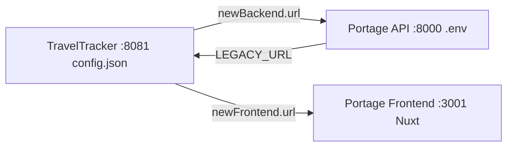

# TravelTracker — Docker Dependency Mapping

## `config.json` → Docker Services {#wiki-docker-traveltracker-docker-dependency-mapping-config-json-docker-services}

| Config Path | Docker Target | Value (local dev) |
|---|---|---|
| `db.server` | `ttt-database:3306` | `127.0.0.1` |
| `db.user` | — | `admin` |
| `db.database` | — | `travel_tracker_trips` |
| `db.prefix` | — | `ez_` |
| `redis.host` | `ttt-redis:6379` | `127.0.0.1` |
| `redis.port` | `ttt-redis:6379` | `6379` |
| `server.port` | — | `8081` |
| `newBackend.url` | — | `http://traveltrackertrips.transact.com:8000` |
| `newFrontend.url` | — | `http://ezat-local.transact.com:3000` |

---

## Cross-App Communication {#wiki-docker-traveltracker-docker-dependency-mapping-cross-app-communication}

| Direction | Source Config | Target |
|---|---|---|
| TravelTracker → Portage API | `config.json` → `newBackend.url` | `http://traveltrackertrips.transact.com:8000` |
| TravelTracker → Portage FE | `config.json` → `newFrontend.url` | `http://ezat-local.transact.com:3000` |
| Portage API → TravelTracker | `.env` → `LEGACY_URL` | `http://traveltrackertrips.transact.com:8081` |

---

---

