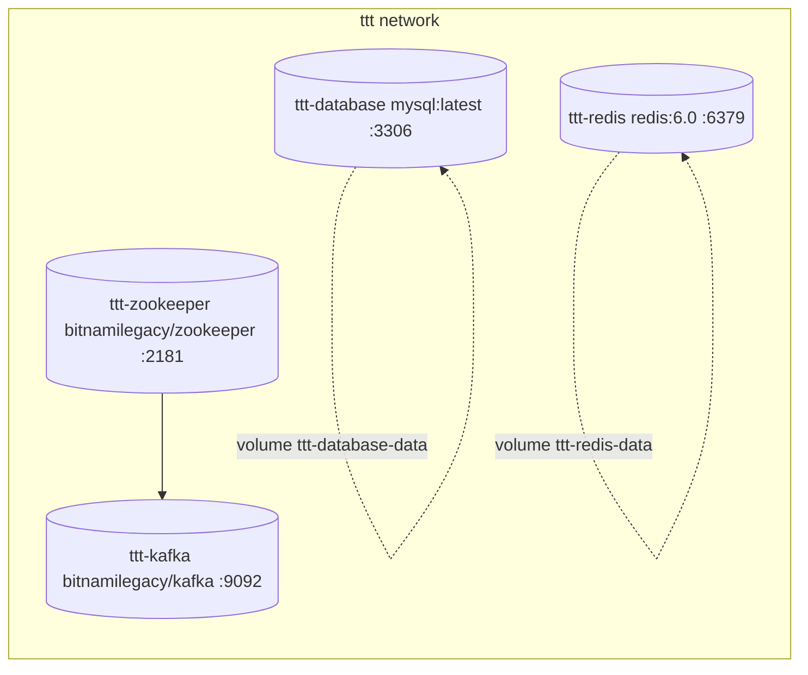

# TravelTracker Infrastructure Stack

## Commands {#wiki-docker-traveltracker-infrastructure-stack-commands}

```bash
# Start all infrastructure services
cd TravelTracker/setup/docker
docker-compose up -d

# Or use the npm script from TravelTracker root
cd TravelTracker
npm run build:docker

# Stop (preserves data volumes)
docker-compose down

# Stop and destroy all data
docker-compose down -v

# View logs for a specific service
docker-compose logs -f ttt-database
docker-compose logs -f ttt-kafka

# Restart a single service
docker-compose restart ttt-kafka
```

---

---

## Credentials {#wiki-docker-traveltracker-infrastructure-stack-credentials}

| Role | Username | Password | Auth Plugin |
|---|---|---|---|
| Root | `root` | `secret` | default |
| Application | `admin` | `secret` | `mysql_native_password` |

---

## Extra Hosts {#wiki-docker-traveltracker-infrastructure-stack-extra-hosts}

Both `ttt-database` and `ttt-redis` have:
```
host.docker.internal:host-gateway
```
This allows containers to reach services running on the Docker host.

---

## Init Script (`init.local.sql`) {#wiki-docker-traveltracker-infrastructure-stack-init-script-init-local-sql}

Executed once on first container start. Contents:

```sql
CREATE DATABASE IF NOT EXISTS travel_tracker_trips;

GRANT CREATE, CREATE VIEW, ALTER, INDEX, LOCK TABLES, REFERENCES, UPDATE, DELETE, DROP, SELECT, INSERT ON *.* TO 'admin'@'%';
ALTER USER 'admin'@'%' IDENTIFIED WITH mysql_native_password BY 'secret';

FLUSH PRIVILEGES;
```

**Databases created:** `travel_tracker_trips`

**Important:** The Portage backend also needs the `ez_colbert` database (client DB). This is **not** created by the init script and must be created manually if missing.

---

## Kafka Configuration {#wiki-docker-traveltracker-infrastructure-stack-kafka-configuration}

| Env Variable | Value |
|---|---|
| `KAFKA_BROKER_ID` | `1` |
| `KAFKA_CFG_ZOOKEEPER_CONNECT` | `ttt-zookeeper:2181` |
| `KAFKA_CFG_LISTENERS` | `PLAINTEXT://:9092` |
| `KAFKA_CFG_ADVERTISED_LISTENERS` | `PLAINTEXT://127.0.0.1:9092` |
| `KAFKA_CFG_LISTENER_SECURITY_PROTOCOL_MAP` | `PLAINTEXT:PLAINTEXT` |
| `ALLOW_PLAINTEXT_LISTENER` | `true` |
| `KAFKA_ENABLE_KRAFT` | `false` |
| `KAFKA_CFG_MESSAGE_MAX_BYTES` | `10485880` |

---

## Network {#wiki-docker-traveltracker-infrastructure-stack-network}

- **Name:** `ttt`
- **Type:** Custom bridge network
- All services are attached to this network

---

## Services {#wiki-docker-traveltracker-infrastructure-stack-services}



| Service Key | Container Name | Image | Host Port → Container Port | Purpose |
|---|---|---|---|---|
| `ttt-database` | `ttt-database` | `mysql:latest` | `3306 → 3306` | Primary MySQL database |
| `ttt-redis` | `ttt-redis` | `redis:6.0` | `6379 → 6379` | Cache / session store |
| `zookeeper` | `ttt-zookeeper` | `bitnamilegacy/zookeeper:3.9.3-debian-12-r22` | `2181 → 2181` | Kafka coordination |
| `ttt-kafka` | `ttt-kafka` | `bitnamilegacy/kafka:3.6.2` | `9092 → 9092` | Event message broker |

---

## Volumes {#wiki-docker-traveltracker-infrastructure-stack-volumes}

| Volume Name | Mounted To | Service |
|---|---|---|
| `ttt-database-data` | `/var/lib/mysql` | `ttt-database` |
| `ttt-redis-data` | `/data` | `ttt-redis` |

---

