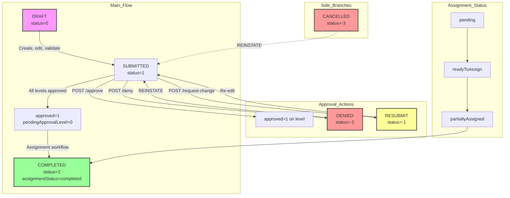

# Trip Request Lifecycle

## Backend Endpoints {#wiki-trip-request-lifecycle-backend-endpoints}

| Method   | Endpoint                                               | Purpose                                       |
| -------- | ------------------------------------------------------ | --------------------------------------------- |
| `POST`   | `/trip-request`                                        | Create a new trip (as DRAFT)                  |
| `POST`   | `/trip-request/update`                                 | Update a trip request                         |
| `POST`   | `/trip-request/validate`                               | Validate a full trip request                  |
| `POST`   | `/trip-request/validate-section/:section`              | Validate a single section                     |
| `POST`   | `/trip-request/submit/:id`                             | Submit a trip (validates first, then submits) |
| `POST`   | `/trip-request/reschedule`                             | Reschedule an existing trip                   |
| `POST`   | `/trip-request/duplicate/:id`                          | Duplicate a trip (creates new DRAFT)          |
| `DELETE` | `/trip-request/:id`                                    | Delete a trip request                         |
| `POST`   | `/trip-request/operation/cancel`                       | Cancel one or more trips                      |
| `POST`   | `/trip-request/reinstate/:id`                          | Reinstate a cancelled trip back to SUBMITTED  |
| `POST`   | `/trip-request/operation/change-submitter`             | Change the submitter                          |
| `POST`   | `/trip-request/list/get`                               | List trips with filters                       |
| `POST`   | `/trip-request/get/:id`                                | Get single trip by ID                         |
| `POST`   | `/trip-request/request-quote`                          | Request a trip estimate/quote                 |
| `POST`   | `/trip-request/trip-estimate/download`                 | Download trip estimate PDF                    |
| `POST`   | `/trip-request/permission-slip/download`               | Download permission slip                      |
| `POST`   | `/trip-request/comment/add`                            | Add comment to trip                           |
| `POST`   | `/trip-request/comment/list/:id`                       | Get comments for a trip                       |
| `POST`   | `/trip-request/audit-history/:id`                      | Get audit history for a trip                  |
| `POST`   | `/trip-request/email-history/:id`                      | Get email history for a trip                  |
| `POST`   | `/trip-request/operation/send-scheduled-notifications` | Send scheduled notifications                  |
| `POST`   | `/trip-request/save-recurrence`                        | Save recurring trip pattern                   |

---

## Event Handlers {#wiki-trip-request-lifecycle-event-handlers}

Every lifecycle action emits a domain event handled by `TripRequestHandlerService`:

| Event                           | Handler                              | What it does                                                                                                                          |
| ------------------------------- | ------------------------------------ | ------------------------------------------------------------------------------------------------------------------------------------- |
| `TRIP_REQUEST_CREATE`           | `handleOnTripRequestCreate`          | Logs audit entry if part of a batch                                                                                                   |
| `TRIP_REQUEST_UPDATE`           | `handleOnTripRequestUpdate`          | Updates assignment status, syncs funding to invoices, logs field changes, refreshes approval levels if status=SUBMITTED               |
| `TRIP_REQUEST_SUBMIT`           | `handleOnTripRequestSubmit`          | Logs audit ("Submitted" or "Resubmitted"), sets `pendingApprovalLevel` or `approved: 1`, creates recurring trips, sends notifications |
| `TRIP_REQUEST_CANCEL`           | `handleOnTripRequestCancel`          | Deletes all assignments, sends cancellation notifications, logs audit with reason                                                     |
| `TRIP_REQUEST_RESCHEDULE`       | `handleOnTripRequestReschedule`      | Logs audit with old/new dates                                                                                                         |
| `TRIP_REQUEST_DUPLICATED`       | `handleOnTripRequestDuplicate`       | Logs audit "Duplicated from Trip #X"                                                                                                  |
| `TRIP_REQUEST_REINSTATE`        | `handleOnTripRequestReinstate`       | Logs audit "Trip Request Reinstated"                                                                                                  |
| `TRIP_REQUEST_CHANGE_SUBMITTER` | `handleOnTripRequestChangeSubmitter` | Logs audit for each trip with old/new submitter names                                                                                 |
| `TRIP_REQUEST_DELETE`           | `handleOnTripRequestDelete`          | Logs audit "Trip Request Deleted"                                                                                                     |

---

## Frontend Flow {#wiki-trip-request-lifecycle-frontend-flow}

1. **Create** — `TripRequestCreate.vue` (8-step wizard), saves as draft via `tripRequestStore.saveTrip()`
2. **Submit** — `TripRequestViewEdit.vue` calls `tripRequestStore.submitTrip(id)` after validating all sections
3. **List** — `TripRequestList.vue` with 35+ filters, color-coded status badges, context menu actions
4. **View/Edit** — `TripRequestViewEdit.vue` with tabbed sidebar (details, approvals, assignments, invoice, comments, emails, audit)
5. **Approve** — `TripActionBar.vue` with Approve/Deny/Request Changes buttons, calls `tripApprovalStore`
6. **Bulk Approve** — `DialogBulkApprove.vue` for mass approval of trips matching filter criteria
7. **Cancel** — `DialogCancelTrip.vue` (single) or `DialogCancelTripRequests.vue` (bulk) modal with reason input
8. **Reschedule** — `DialogRescheduleTrip.vue` modal with new date pickers
9. **Duplicate** — `DialogCreateDuplicate.vue` modal
10. **Change Submitter** — `DialogChangeSubmitterAllTrips.vue` for reassigning submitter across multiple trips
11. **Mass Assign** — `DialogMassAssign.vue` for bulk driver/vehicle assignment
12. **Exit prompt** — Middleware `03-trip-create-exit-prompt.global.ts` blocks navigation on unsaved changes

**Key Vue components** (`modules/trip-request/`):

| Component                        | Purpose                                            |
| -------------------------------- | -------------------------------------------------- |
| `TripRequestCreate.vue`          | 8-step trip creation wizard                        |
| `TripRequestViewEdit.vue`        | Main trip view/edit with tabbed interface          |
| `TripRequestList.vue`            | Paginated list with filters, sorting, bulk actions |
| `TripActionBar.vue`              | Action buttons (Approve, Deny, Request Changes)    |
| `DialogBulkApprove.vue`          | Bulk approval modal                                |
| `DialogCancelTrip.vue`           | Cancel single trip modal                           |
| `DialogCancelTripRequests.vue`   | Cancel multiple trips modal                        |
| `DialogRescheduleTrip.vue`       | Reschedule modal                                   |
| `DialogCreateDuplicate.vue`      | Duplicate trip modal                               |
| `review-tabs/ApprovalStatus.vue` | Approval level status display                      |
| `review-tabs/TripDetails.vue`    | Trip details display                               |
| `review-tabs/AssignmentTab.vue`  | Assignment management                              |
| `review-tabs/InvoiceTab.vue`     | Invoice/estimate tab                               |
| `review-tabs/CommentsTab.vue`    | Comments thread                                    |
| `review-tabs/EmailsTab.vue`      | Email history                                      |
| `review-tabs/AuditTab.vue`       | Audit log                                          |

---

---

## Status Flow {#wiki-trip-request-lifecycle-status-flow}



**Status constants** (`libs/common/constants/trip-request.constants.ts`):

```typescript
export const TRIP_STATUS = {
  DRAFT: 0,
  SUBMITTED: 1,
  COMPLETED: 2,
  RESUBMIT: -1,
  DENIED: -2,
  CANCELLED: -3,
};
```

**Display statuses** (computed in SQL query):

- `not_submitted` — status 0 (draft)
- `pending_approval` — submitted but not all levels approved
- `approved` — all levels approved, not yet assigned
- `approved_and_assigned` — all levels approved + assignmentStatus = 'completed'
- `change_requested` — status -1 (resubmit)
- `canceled` — status -3
- `denied` — status -2
- `completed` — status 2

**Assignment statuses** (`libs/common/constants/assignment.constants.ts`):

- `pending` — no assignments yet
- `readyToAssign` — trip is approved, ready for driver/vehicle assignment
- `partiallyAssigned` — some but not all drivers/vehicles assigned
- `partiallyAssignedDriver` — drivers assigned, vehicles pending
- `partiallyAssignedVehicle` — vehicles assigned, drivers pending
- `completed` — all drivers and vehicles assigned

---

