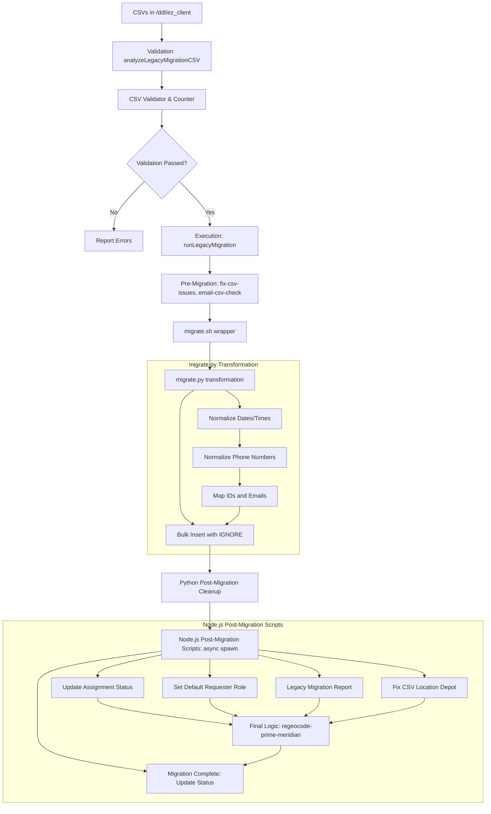

# Legacy Migrations Wiki

This document covers the legacy migration process for TravelTracker, involving CSV validation, data transformation, and SQL migration.

> **Scale note:** `migrate.py` is ~6,274 lines and handles 50+ tables per client. Each client directory (e.g., `ez_albany`) contains 56+ CSV files.

## Core Migration Files

| File | Description |
|---|---|
| `/transAct/TravelTracker/ddl/migrate.py` | The main Python script (~6,274 lines) that handles data transformation and insertion into the database. |
| `/transAct/TravelTracker/ddl/migrate.sh` | Shell script wrapper for running `migrate.py`. |
| `/transAct/TravelTracker/app/admin/legacy-migration-csv-validator.js` | Node.js validator that checks CSV files for schema compliance and data integrity (FKs, IDs, formats). |
| `/transAct/TravelTracker/app/admin/legacy-fix-csv-issues.js` | Performs automatic structural repairs (quotes, semicolon splitting) on source CSVs. |
| `/transAct/TravelTracker/app/admin/legacy-utils.js` | Shared utilities for mapping CSV filenames to table names and parsing files. |
| `/transAct/TravelTracker/app/admin/index.js` | Contains the administrative logic to trigger migrations and orchestrate post-migration scripts. |
| `/transAct/TravelTracker/setup/scripts/update-trip-request-assignment-status.js` | Syncs assignment and request states for future-dated trips. |
| `/transAct/TravelTracker/setup/scripts/set-default-requester-role.js` | Normalizes user roles and ensures global access for admins. |
| `/transAct/TravelTracker/setup/scripts/legacy-migration-report.js` | Generates a parity report comparing CSV row counts vs. database results. |
| `/transAct/TravelTracker/app/admin/regeocode-prime-meridian-addresses.js` | Resolves leftover invalid coordinates using the application's geo-provider. |

## Migration Process Flow

### Step-by-Step Breakdown

1.  **Preparation**: CSV files are exported and placed in client-specific folders under `/transAct/TravelTracker/ddl/ez_[client_name]`.
2.  **Validation**: `analyzeLegacyMigrationCSV` in `app/admin/index.js` calls the validator and counter to ensure data quality and provide row counts.
3.  **Execution**: `runLegacyMigration` triggers the process:
    *   **Pre-Migration**: Runs `legacy-fix-csv-issues.js` and `legacy-user-email-csv-check.js`.
    *   **Shell Wrapper**: Executes `migrate.sh`.
4.  **Transformation (`migrate.py`)**:
    *   Reads CSV files.
    *   Normalizes dates, times, and phone numbers.
    *   Maps legacy IDs and emails to current system records.
    *   Performs bulk inserts with `INSERT IGNORE`.
5.  **Post-Migration Cleanup (Python)**: `cleanup_post_migration()` runs 24+ SQL queries:
    1.  Delete orphan `tt_user_role` entries (no matching `tt_user` email)
    2.  Update `funding_source.budgetCodeId` from `budget_code.id`
    3.  Backfill `trip_funding.budgetCode` / `budgetCodeId` from `funding_source`
    4.  Set blank `assignmentStatus` to `'pending'`
    5.  Update `trip_request.category` from `trip_type.categoryId`
    6.  Link `funding_source.approverId` via email match to `tt_user`
    7.  Fix addresses with zip `'0'` using lat/lng matching against valid addresses
    8.  Set `trip_funding.budgetCode` to `''` where `budgetCodeId` is NULL
    9.  Link `assignment.driverEmail` / `driverId` via staff name match
    10. Fix Prime Meridian addresses (51.4769, 0.0005) by copying from valid addresses with same name
    11. Set remaining Prime Meridian addresses to default placeholder values
    12. Set `address.recordId` from matching `school.id`
    13. Delete `tt_user_role` entries for inactive schools
    14. Update `driver_trips_hours` with calculated trips and hours from assignments
    15. Update `trip_type_fiscal_data.fiscalYearId` to current fiscal year
    16. Update `vehicleextra.driverId` from `tt_staff.assignedVehicleId`
    17. Replace spaces with commas in `budget_code.code`
    18. Replace `?` placeholders in `trip_funding.budgetCode` with location codes
    19. Insert missing `invoice_payment` records with pre-filled amounts
    20. Truncate `invoice_comment` table
    21. Clear `assignment.vehicle` for vehicles not in `vwAllVehicles`
    22. Set `approval_level.created` to current fiscal year - 1 day
    23. Update `destination.category` to `'School'` when location code matches
    24. Remove `fundingSourceType` from `invoice_payment` when only one funding source exists
    *   **Vehicle type hiding**: Sets `hidden = 1` for Rental/Dealership, Contractor, Approved Charter types if not present in CSV
    *   **`submittedUser` backfill**: Batch updates `trip_request.submittedUser` from CSV email data
    *   **School activation**: Activates schools referenced in `tt_user_role`
    *   **School stop backfill**: Creates missing stops, stopextra, and addresses from school primary addresses
    *   **Approval level sequencing**: Re-sequences `approval_level.seq` in order
    *   **Trip request stop sequencing**: Re-sequences stops per trip with depart/return ordering
    *   **`sanity_checks()`**: Final internal audit for broken references
6.  **Node Post-Migration Scripts**: Orchestrated in `app/admin/index.js` using `spawn` for parallel execution:
    *   `setup/scripts/update-trip-request-assignment-status.js`: Syncs request and assignment states.
    *   `setup/scripts/set-default-requester-role.js`: Ensures all users have necessary roles.
    *   `setup/scripts/legacy-migration-report.js`: Compares CSV row counts vs Database row counts to identify missing data.
    *   `setup/scripts/legacy-fix-csv-location-depot.js`: Specific fixes for depot locations.
    *   **Final Step**: Calls `regeocode-prime-meridian-addresses.js` to fix invalid coordinates.

## Detailed Execution Chain & Logic

The migration follows a strict sequential chain. Below is the breakdown of exactly which files and functions are called, and their specific responsibilities.

### Stage 1: Validation & Preparation
**Triggered by:** `analyzeLegacyMigrationCSV(req)` in `app/admin/index.js`

1.  **`findMigrationFolder(client)`**:
    *   Calls `ddl/copy.sh` to pull CSVs from the source server to the local `ddl/ez_[client]` directory.
2.  **`validator.run({ dir, client })`** (in `legacy-migration-csv-validator.js`):
    *   **Logic**: Iterates through each CSV, checking against a strict schema.
    *   **Key Checks**: `FK_NOT_FOUND` (checks if IDs in `trip_request.csv` exist in `tt_user.csv`), `DATE_FORMAT`, and `REQUIRED_FIELD`.
3.  **`counter.run({ dir })`** (in `legacy-migration-csv-counter.js`):
    *   Provides raw row counts for the UI and initial reconciliation.

### Stage 2: Pre-Migration Repairs
**Triggered by:** `runLegacyMigration(req)` -> `runPreMigrationChecks()`

1.  **`legacyFixCsvIssues({ context })`** (in `legacy-fix-csv-issues.js`):
    *   **`handlers.trip_request`**: Fixes malformed quotes that break CSV parsers.
    *   **`handlers.trip_event`**: Splits semicolon-delimited `tripTypeId` values into separate rows.
2.  **`legacyTtUserEmailFix({ dir })`** (in `legacy-user-email-csv-check.js`):
    *   Ensures consistent casing and format for user emails in the CSVs to prevent join failures during migration.

### Stage 3: Core Python Migration
**Triggered by:** `execSync('sh ./ddl/migrate.sh ...')`

1.  **`migrate.sh`**:
    *   Wrapper that passes database credentials and the client-specific path to the Python environment.
    *   Usage: `sh ./ddl/migrate.sh ddl/ez_<client> <routing_bool> ez_<client> <dbUser> <dbPass> <dbHost>`
2.  **`migrate.py`** — Table migration order (strict dependency chain):
    1.  **Semester** — Resets and seeds `2025 ~ 2026` / `2026 ~ 2027` (non-routing clients)
    2.  **Stop / Stopextra** — Built from address + trip_request_stop CSVs
    3.  **VehicleType** — Migrated from CSV
    4.  **Vehicle / tt_vehicle** — With semester and stop linkage
    5.  **Staff / tt_staff** — With location, vehicle, fiscal year linkage
    6.  **Location / School** — Loaded, then removed from csv_dict
    7.  **Destination** — Migrated, then dict refreshed from DB
    8.  **Address** — Bulk migration with trip_request_stop cross-reference
    9.  **Budget Code** — Simple insert
    10. **Funding Source** — With approver email → tt_user linkage
    11. **Staff / tt_staff** — Second pass
    12. **Approver** — With location and trip type linkage
    13. **tt_user_role** — Site level authorities
    14. **Trip Request Stop** — Trip-level stops
    15. **Trip Request** — Core trip data with full foreign key resolution
    16. **Assignment** — Linked to trip_request, staff, vehicles
    17. **Driver Log** — Updated from assignment data
    18. **Remaining tables** — All non-skip tables via generic `migrate_table()`
    19. **Trip Funding** — Migrated after trip_request exists
    20. **Trip Approvals** — With user email resolution
    21. **Invoices** — Migrated last (after all dependencies: assignment, trip_request, staff, etc.)
    22. **Config** — Final tt_config update with trip events, approval levels, vehicle types, roles
3.  **`migrate.py`** — Key mechanisms:
    *   **`toById()` / `toByName()`**: Loads companion CSVs (Users, Fiscal Years, etc.) into memory-efficient hash maps.
    *   **`bulk_insert(cursor, sql, rows)`**: The primary engine. It tries a strict batch insert first; if it fails, it retries with `INSERT IGNORE` on individual records to isolate bad data.
    *   **`trip_request_event` handling** (lines 1230-1657):
        *   Junction records are derived entirely from the `tripEventIds` field on each trip request row (line 1559). The field is split by `;`, each event name is looked up in `trip_events_by_name`, and if not found (`found == 0`), a new `trip_event` row is created via `INSERT IGNORE`. The resulting `(tripRequestId, tripEventId)` pair is appended to `to_insert_trip_request_event`.
        *   The table is truncated and bulk-inserted at lines 1654-1657 with only the accumulated `to_insert_trip_request_event` list. The standalone `trip_request_event.csv` is not used as the source of truth — the `tripEventIds` field on the trip request is authoritative.

### Stage 4: Node.js Post-Migration Orchestration
**Triggered by:** `runPostMigrationScript(client)` (using `spawn` for parallel execution)

1.  **`update-trip-request-assignment-status.js`**:
    *   Uses the `TripRequest` model to refresh statuses (Assigned/Pending) for future trips.
2.  **`set-default-requester-role.js`**:
    *   Logic: Ensures all users have at least a "Requester" role and fixes Admin permissions.
3.  **`legacy-migration-report.js`**:
    *   **`fileNameToTableName()`**: Maps `123_tt_user.csv` to `tt_user` table.
    *   **`run()`**: Performs the final reconciliation (CSV rows vs. DB rows).
4.  **`regeocode-prime-meridian-addresses.js`**:
    *   **`reverseGeocodeLatLngSet()`**: Sends coordinates to the Google/Bing API for any address still stuck at the "Prime Meridian" (51.4769, 0.0005).

### Stage 5: Finalization
1.  **`setClientMigrationStatus(client, 'complete')`**:
    *   Updates the `client` table in the `admin` database to mark the process as finished.

### Python Utilities (`migrate.py`)
The Python script employs several normalization and mapping utilities to handle legacy data inconsistencies:

| Function | Logic | Purpose |
|---|---|---|
| `get_24h_time(time_str)` | Regex/strptime: `%I:%M:%S %p` or `%I:%M %p` | Normalizes 12h AM/PM strings to 24h `HH:MM`. |
| `to_phone_no(val)` | Strips non-digits; enforces 10-digit length | Standardizes phone numbers; defaults to `5555555555`. |
| `get_date(date_str)` | `%m/%d/%Y` -> `%Y-%m-%d` | Normalizes date formats for MySQL. |
| `bulk_insert` | Chunks records (1000) with error fallback | Attempts strict insert; fallbacks to individual `INSERT IGNORE` on failure. |

### Data Mapping Strategy
- **Reference Resolution**: Most legacy IDs are resolved using `toById` or `toByName` maps created from companion CSV files (e.g., `tt_user.csv`, `fiscal_year.csv`).
- **Missing Coordinates**: Records missing geodata are assigned the **Prime Meridian** default:
  - Lat: `51.4769`, Lng: `0.0005`
  - Post-migration Node/SQL tasks attempt to fix these via re-geocoding.

## Table Dependencies & Requirements

| Table | Dependency | Logic Note |
|---|---|---|
| `semester` | None | Reset and seeded with 2025-2026 / 2026-2027 on first run (non-routing) |
| `stop` / `stopextra` | `address`, `trip_request_stop`, `semester` | Built from CSV addresses + trip stops; backfilled from school primaries if gaps |
| `vehicletype` | None | Hidden flag set for unused types (Rental/Dealership, Contractor, Approved Charter) |
| `vehicle` / `tt_vehicle` | `vehicletype`, `stop`, `semester`, `staff` | Vehicle records with stop depot and assigned driver linkage |
| `staff` / `tt_staff` | `location`, `vehicle`, `fiscal_year` | Staff records with location and vehicle assignment |
| `location` / `school` | None | Loaded into dicts then removed from csv_dict (shared tables) |
| `destination` | `location` | Migrated first, then dict refreshed from DB for downstream lookups |
| `address` | `school`, `stop`, `destination`, `semester` | Bulk migration with trip_request_stop cross-reference; Prime Meridian defaults for missing coords |
| `budget_code` | None | Simple insert; spaces replaced with commas post-migration |
| `funding_source` | `budget_code`, `tt_user` | Links approver via email; budgetCodeId from budget_code |
| `approver` | `location`, `tt_user`, `trip_type` | Approver records with location and trip type scope |
| `tt_user_role` | `tt_user`, `location` | Site-level authorities; orphan entries deleted in cleanup |
| `trip_request_stop` | `trip_request`, `stop`, `destination` | Trip-level stops; re-sequenced post-migration |
| `trip_request` | `tt_user`, `fiscal_year`, `semester`, `trip_type`, `location`, `stop`, `destination` | Core trip data; `submittedUser` backfilled from CSV emails |
| `assignment` | `trip_request`, `staff`, `vehicle` | Driver linked by name match fallback; vehicle cleared if not in vwAllVehicles |
| `trip_funding` | `trip_request`, `funding_source` | Budget codes backfilled from funding_source |
| `invoice` + children | `assignment`, `trip_request`, `staff`, `semester` | Migrated last; missing invoice_payment records auto-created with calculated amounts |
| `trip_approvals` / `level_approval` | `trip_request`, `tt_user`, `approval_level` | Approval chain with user email resolution |
| `tt_config` | `trip_event`, `approval_level`, `vehicletype`, `tt_role` | Final config update with all reference data |

## Pre-Migration CSV Fixes (`legacy-fix-csv-issues.js`)

Before the Python migration runs, the Node.js orchestration layer performs automatic structural repairs on legacy CSV files to prevent common parser failures:

| Table Target | Logic Applied |
|---|---|
| `trip_request` | **Quote Fix**: Detects `InvalidQuotes` or `MissingQuotes` and converts double quotes (`"`) to single quotes (`'`) within rows to prevent row-splitting. |
| `trip_event` | **Multi-Type Split**: If `tripTypeId` contains a semicolon-delimited list (e.g., `1;3`), it splits the record into multiple individual rows with unique IDs. |
| `approver` | **Type Duplication**: Automatically clones approvers with `tripTypeId: 1` to create a corresponding entry for `tripTypeId: 3` (Approved Charter). |

---

## Post-Migration Node.js Orchestration

After `migrate.py` completes, `app/admin/index.js` spawns several specialized Node.js scripts in parallel to handle logic that is more efficiently processed via the application's ORM or complex JS-based iteration:

### 1. Assignment Status Sync (`update-trip-request-assignment-status.js`)
- **Action**: Queries all `trip_request` records with a `leaveDate` in the future.
- **Logic**: Calls the internal `trip-request` module to recalculate and update the `assignmentStatus` field based on the state of linked assignments (e.g., transitioning from `pending` to `assigned` or `partially-assigned`).

### 2. Role Normalization (`set-default-requester-role.js`)
- **Action**: Enforces standard security and role constraints across all migrated users.
- **Logic**:
  - Deletes all existing "Requester" (Role ID 19) entries to prevent duplicates.
  - Updates "Super Admin" (Role 1) and "Transport Admin" (Role 2) to ensure their `locationId` is `0` (global access).
  - Automatically grants the "Requester" role (Role 19) with `locationId: 0` to any user who is NOT a Super Admin or Transport Admin.

### 3. Data Integrity Reporting (`legacy-migration-report.js`)
- **Action**: Generates a JSON audit report comparing the source CSVs to the resulting database state.
- **Logic**:
  - Iterates through `TABLES_TO_CHECK` (e.g., `tt_user`, `trip_request`, `assignment`).
  - Extracts expected row counts from CSVs using `papaparse`.
  - Queries actual row counts from the client database.
  - **Output**: Writes `migration-report.json`. If `csvRows > dbRows`, it flags a warning indicating potential data loss or ingestion failure.

### 4. Final Geocoding Fix (`regeocode-prime-meridian-addresses.js`)
- **Action**: Triggered as the final step after all parallel scripts finish.
- **Logic**: Attempts to resolve the "Prime Meridian" coordinates (51.4769, 0.0005) for addresses that could not be matched during the Python migration by using the application's geocoding provider.

## Configuration & Environment
- **Database**: Requires a MySQL user with `FILE` privileges (for `LOCAL INFILE`) and `DROP`/`CREATE` permissions for the client database.
- **Node.js**: Parallel spawning of scripts requires the `mysql-wrapper` and `shared` libs to be correctly linked.
- **Paths**: `migrate.sh` expects the client data folder to follow the `ez_[client_name]` naming convention.

## Troubleshooting Common Issues

| Symptom | Probable Cause | Fix |
|---|---|---|
| `FK_NOT_FOUND` in Validator | Missing parent record in companion CSV | Ensure all related CSVs (e.g., `tt_user.csv`) are updated and present. |
| `driverId` is `0` in assignments | Staff name mismatch in `staff.csv` | Verify names match exactly in the CSV; fallback logic uses `CONCAT(firstName, ' ', lastName)`. |
| "Prime Meridian" addresses remain | No successful geocodes for that location name | Manually update address in the UI or check `regeocode-prime-meridian-addresses.js` logs. |
| SQL Timeout during `driver_trips_hours` | Large dataset with complex joins | Ensure indexes exist on `assignment.driverId` and `trip_request.fiscalYearId`. |
| `csvRows > dbRows` in migration report | Data filtered out by FK constraints or `INSERT IGNORE` | Check `cleanup_post_migration` logs; verify parent records exist before child inserts. |
| `UnicodeDecodeError` during CSV read | Non-UTF-8 encoding in legacy CSV | Script tries `utf-8-sig` → `cp1252` → `latin-1` automatically; if all fail, convert source file. |
